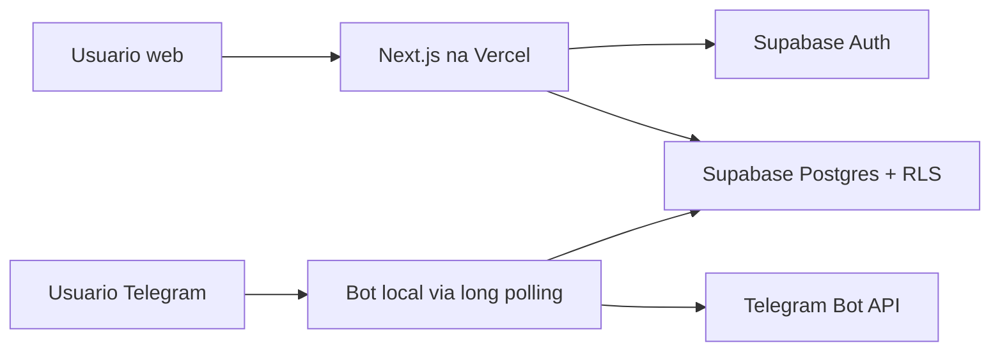

# Arquitetura FluxoPay

## Analise do projeto

O produto precisa equilibrar quatro forcas:

- Custo zero no inicio.
- Seguranca real para dados financeiros.
- Estrutura simples o bastante para evoluir em fases pequenas.
- Caminho claro para monetizacao futura com assinaturas.

A escolha principal e deixar a aplicacao web stateless na Vercel, com Supabase
cuidando de Auth, banco e RLS. O bot fica fora da Vercel, rodando em long
polling na maquina local 24h. Isso evita IP publico fixo, webhook e servidor
pago.

## Proposta de arquitetura



O frontend usa somente anon key e depende de RLS para isolamento. O bot usa
service role key apenas no ambiente local e deve validar manualmente se o
`telegram_user_id` possui vinculo ativo em `telegram_links` antes de qualquer
operacao financeira.

## Estrutura de pastas

```txt
src/app/(auth)          Rotas publicas de login e cadastro
src/app/(app)           Rotas autenticadas
src/app/auth/callback   Callback de confirmacao/autenticacao Supabase
src/features            Modulos por dominio de produto
src/lib/supabase        Clients Supabase separados por runtime
supabase/migrations     Schema versionado e policies RLS
docs                    Decisoes tecnicas e documentacao do projeto
```

Futuras pastas previstas:

- `apps/bot` ou `bot/` para o worker Telegram.
- `src/features/transactions`
- `src/features/categories`
- `src/features/bills`
- `src/features/cards`
- `src/features/dashboard`

## Modelagem do banco

Tabelas iniciais:

- `profiles`: perfil 1:1 com `auth.users`.
- `categories`: categorias padrao e customizadas por usuario.
- `transactions`: entradas e saidas avulsas.
- `bills`: contas futuras a pagar ou receber.
- `credit_cards`: cadastro de cartoes.
- `credit_card_purchases`: compras feitas em cartao.
- `installments`: parcelas geradas por compra.
- `telegram_links`: vinculo seguro entre usuario e Telegram.
- `bot_pending_confirmations`: mensagens interpretadas aguardando confirmacao.
- `notification_preferences`: preferencias de lembretes e relatorios.

Dinheiro e salvo em centavos (`bigint`) para evitar problemas de precisao.

## Decisoes tecnicas

- Next.js App Router: bom encaixe com Vercel, Server Components e protecao de
  rotas no servidor.
- Supabase Auth: reduz custo e tempo de implementacao para e-mail/senha.
- RLS obrigatorio: principal fronteira de seguranca para isolamento multiuser.
- `proxy.ts`: usado apenas para refresh de sessao, nunca como unica barreira de
  autorizacao.
- `supabase.auth.getUser()`: usado em rotas protegidas porque valida a sessao
  no servidor.
- Service role somente no bot: necessario para operacoes de worker, mas isolado
  fora do frontend.
- Long polling no Telegram: evita IP publico, DNS, webhook e custo de servidor.
- `amount_cents`: evita erro de float em valores monetarios.

## Plano por fases

Fase 1: fundacao segura

- Scaffold Next.js.
- Config Supabase SSR.
- Auth basica.
- Migration com RLS.
- README e arquitetura.

Fase 2: dominio financeiro web

- CRUD de categorias.
- CRUD de transacoes.
- Filtros por periodo, tipo e categoria.
- Dashboard com cards reais.
- Validacao de ownership entre transacoes e categorias no banco.

Fase 3: contas e cartoes

- Contas a pagar/receber persistidas.
- Cartoes de credito persistidos.
- Compras parceladas.
- Geracao automatica de parcelas por fechamento e vencimento.
- Faturas consolidadas por cartao e mes.
- Pagamento de parcela ou fatura com criacao de transacao de saida.

Fase 4: bot Telegram

- `/start`, `/ajuda`, `/saldo`, `/resumo`.
- Vinculo por token.
- Parser inicial por regras.
- Confirmacao antes de salvar.

Fase 5: worker e acabamento de produto

- Lembretes diarios.
- Relatorios semanal/mensal.
- Empty states, loading states, toasts e prints no README.

Fase 6: importacao bancaria

- Importacao CSV/OFX.
- Normalizacao de colunas e pre-visualizacao antes de salvar.
- Deduplicacao basica de lancamentos.

Fase 7: IA e classificacao automatica

- Sugestao de categoria por historico.
- Classificacao assistida, sempre com revisao do usuario no MVP.

Fase 8: Open Finance ou agregador

- Avaliar Pluggy, Belvo, Celcoin ou alternativa conforme custo, cobertura e
  friccao regulatoria.
- Implementar somente se agregar valor real ao produto e couber no modelo de
  monetizacao.

## Riscos e limitacoes do plano gratuito

- Supabase Free pode pausar ou limitar recursos em uso baixo/alto.
- Vercel Free tem limites de build, bandwidth e execucao serverless.
- Bot local depende da maquina 24h, energia e internet residencial.
- Long polling e simples, mas menos elastico que webhook em ambiente gerenciado.
- Service role no bot exige disciplina: logs sem dados sensiveis e `.env.bot`
  nunca versionado.
- Email de confirmacao pode depender da configuracao do Supabase Auth.
- Sem backups automaticos robustos no plano gratuito.

## Regras de seguranca

- Toda tabela financeira precisa ter `user_id`.
- Toda tabela sensivel deve ter RLS habilitado.
- Frontend nunca usa service role.
- Bot nunca confia apenas em `telegram_user_id`; sempre valida vinculo ativo.
- Inputs web passam por Zod.
- Mensagens do bot devem ser normalizadas e limitadas antes do parsing.
- Logs devem mascarar valores sensiveis quando possivel.
